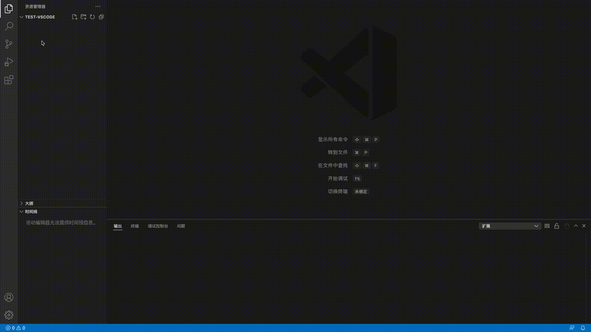
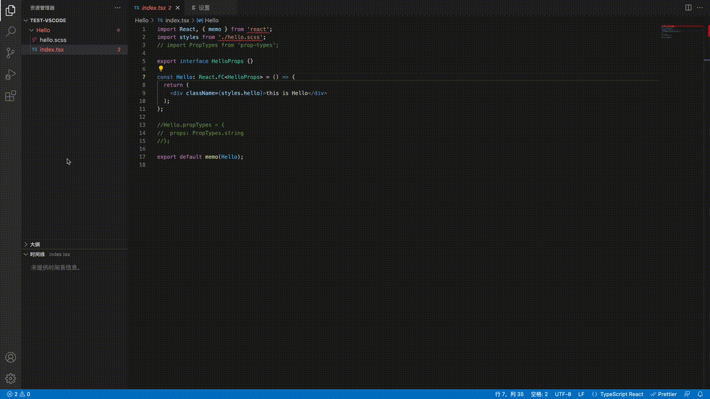

# vscode plugin for generate React, vue, svelte generic templates

> now you can create template like vue, react, react for mini-program, svelte

### Change log
- v0.4.0
  - add: `web-template.parameters.cssInJsFileName` to control the styled file name
  - feature: support to create single file. like `hello.tsx`, `hello.jsx`, `hello.vue`, `hello.svelte`
  - fixed: created an wrong component when press `Esc`

- v0.3.2
  - fix: change mini program import style name

- v0.3.1
  - add `@emotion/styled` options in css-in-js tools (only in react rcc/rfc)
  - support css modules in react-mini-program

- v0.3.0

  - React PropTypes Support Definition Optional. see `web-template.parameters.displayReactPropType`
  - Support css in js template when select `style-components` css types
  - Style file name Support customization. (default is the first lowercase string of the component name) see `web-template.parameters.styleName`

- v0.2.1
  Change classNames and style file name from all lowercase characters become lowercase first character

- v0.2.0

  - The display of the menu supports dynamic configuration. See the new setting `web-template.menus`
  - Add: vue3.0 template
  - Remove: code snippet config
  - Change: classname from all lowercase to lowercase first character

- v0.1.0

  - Add: create react cc/fc component for mini-program

- v0.0.9

  - Add: svelte3 snippet

- v0.0.8

  - Add: svelte template
  - Fix: remove end of space display

- v0.0.7
  - Fix: no css moudles classNames value

### How to use

create React Function Component

change custom menu

### Supported languages

- react

  - react function components / react class components
    - jsx + css/scss/less + css-modules
    - tsx + css/scss/less + css-modules
    - jsx + styled-components
    - tsx + styled-components
  - react function components / react class components for mini-program

- vue

  - vue2.0
  - vue3.0

- svelte
  - svelte3.0

Support typescript, css modules, style type initial configuration
