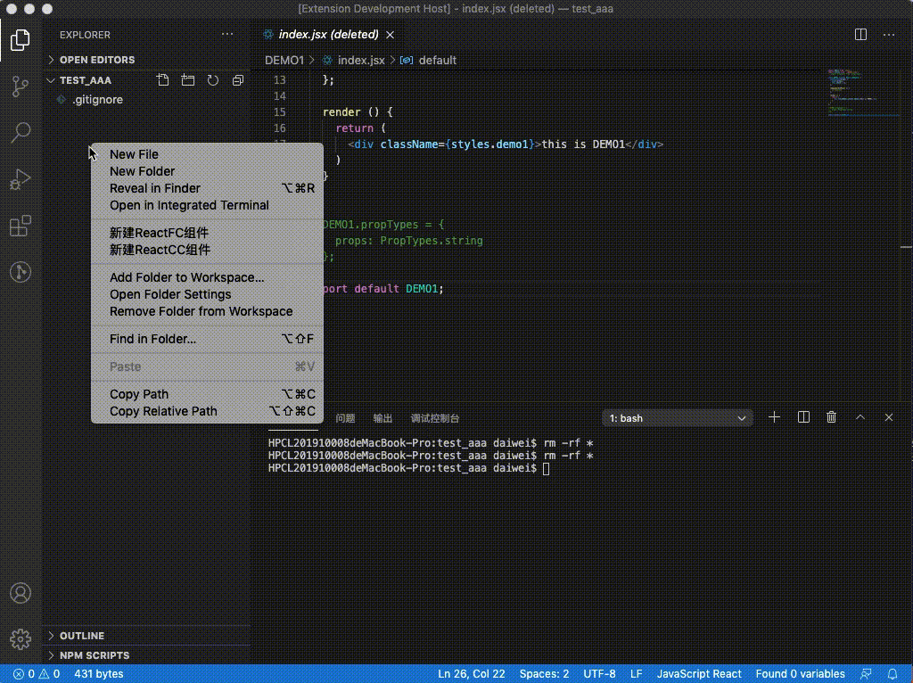
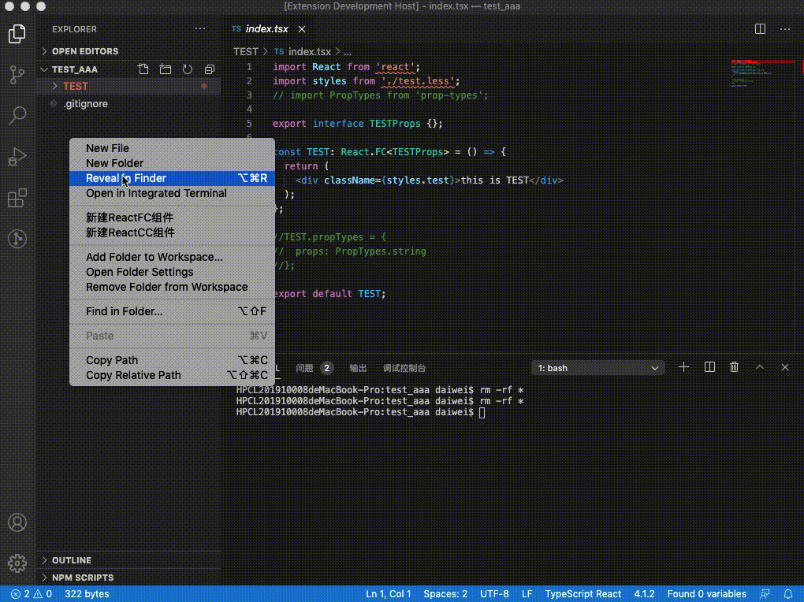
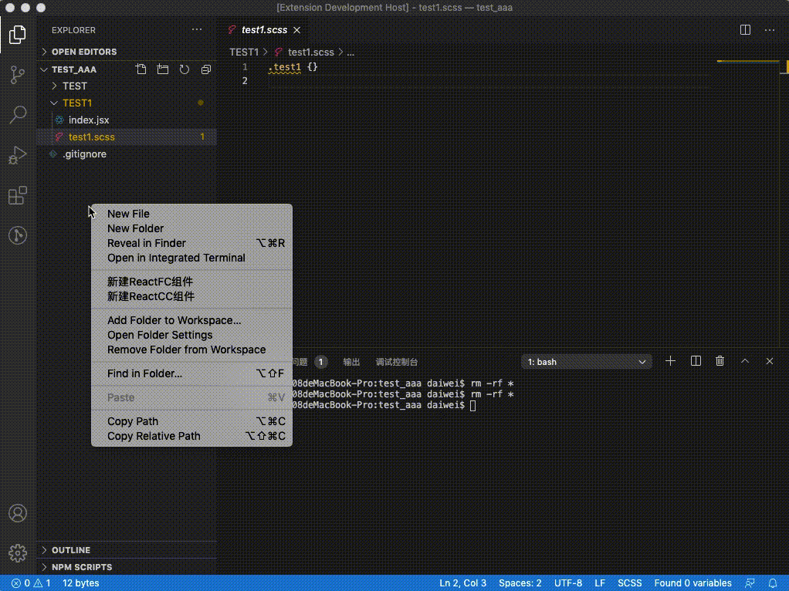

# tiga-vscode-tpl
Quickly generate vscode plugin for react template

### Supported languages 
- react 
  - jsx
  - tsx

### create Tpl
create React Function Component

create React Class Component

### Snippets
support React Snippets

;

|  code  |         Content           |
| :----: | --------------------------|
|  `rfc` |  React Function Component |
|  `rcc` |    React Class Component  |

